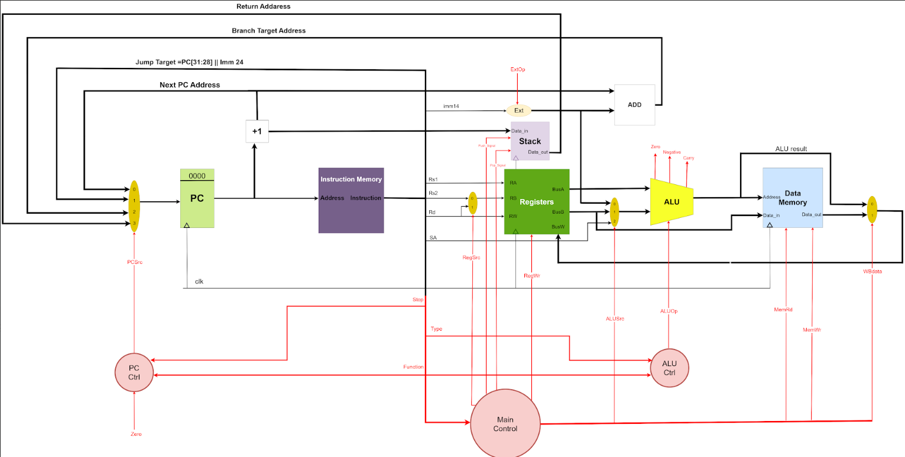
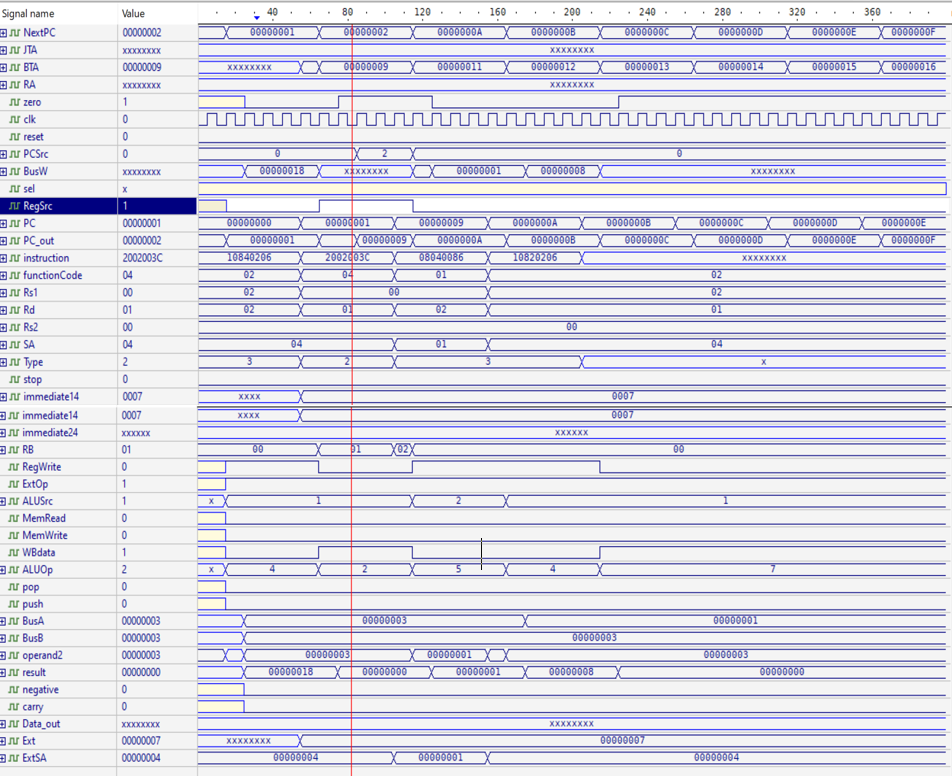

# Project 2
            

# Simple RISC Verilog Processor 

A Simple multi-cycle RISC Verilog processor with architecture similar to MIPS

---

🔗 | [Project Description](./Project-2-Spring+-2022-2023.pdf)  <br>


---

## Data Path




## Code

  ```assembly
  ADDI R1, R0, 'b1000
  ADDI R2, R0, 'b1110
  BEQ R1, R2, 8; not taken (R1 != R2) so R1 becomes 1110
  ADDI R1, R0, 'b1110
  BEQ R1, R2, 8; taken (R1 == R2)
  ADDI R4, R0, 'b1; dead code
  ADDI R5, R0, 'b2; executed
  ```

## Waveform
  
  
 ## Partners
___________________________________________________________
🔗 | [Osaid Hamza](https://github.com/OsaidHamza7)  
🔗 | [Mohammad Odeh](https://github.com/M7mdOdeh1) 
🔗 | [Mahmoud Hamdan](https://github.com/mahmoudbzu)
___________________________________________________________
